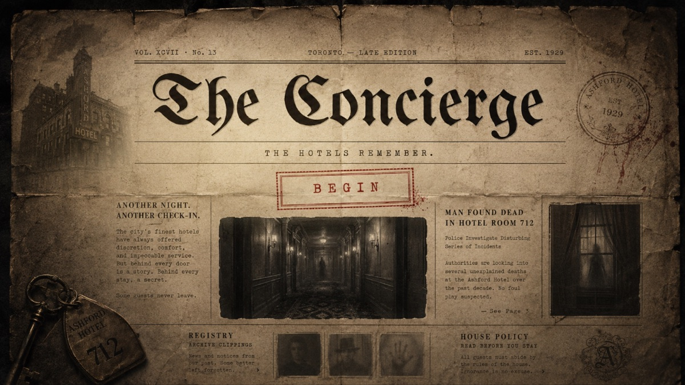
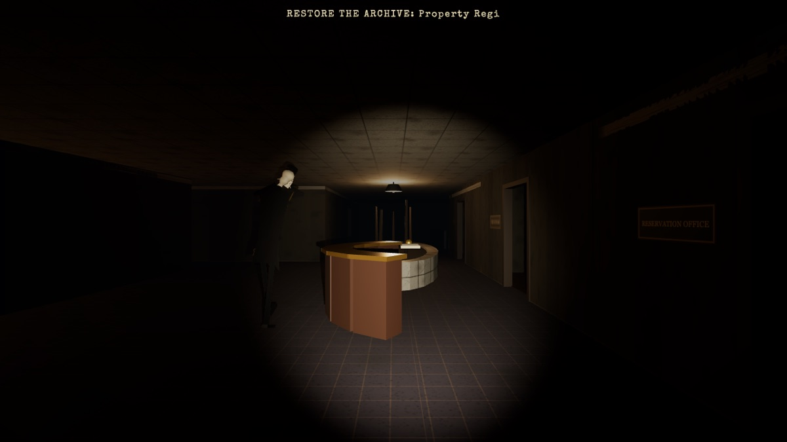
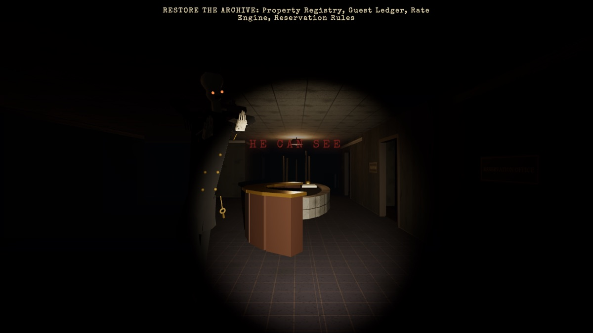
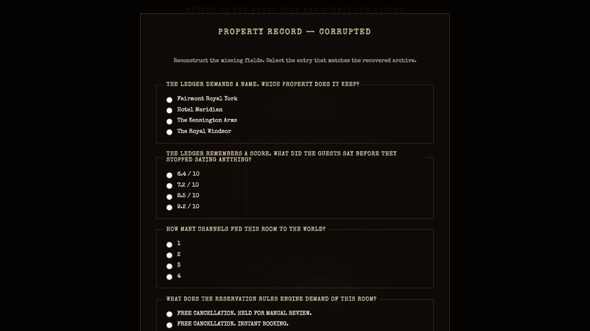
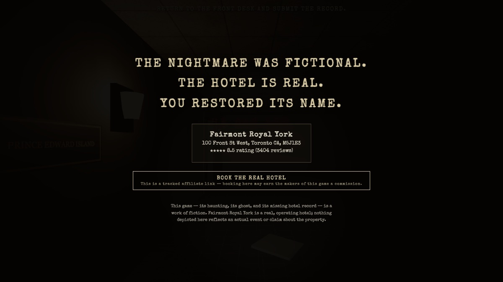
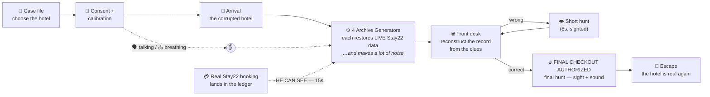
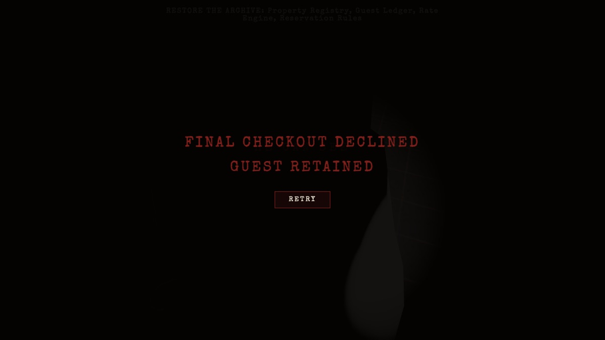
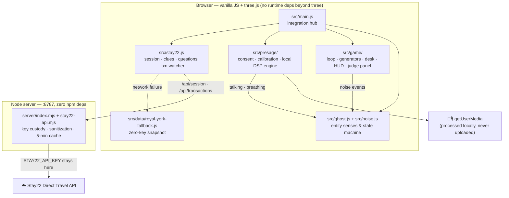

<div align="center">



# T H E &nbsp; C O N C I E R G E

### *The hotels remember.*

**A first-person horror game built inside a real hotel — where live booking data is the mystery,<br/>your own voice and breath are the stealth system, and every real booking makes the monster open its eyes.**

<br/>


<br/>

*Everyone can build a hotel search. We built a hotel you can enter.*

</div>

---

## ▍The premise

The **Fairmont Royal York** — Toronto's grand 1929 railway hotel — has been rebuilt in three.js from its real floor plans, foot for foot. But something has corrupted its record. The rooms are dark. The ledger is blank. And the thing at the front desk — a decayed concierge, hands pressed over its eyes — hunts by **sound alone**.

Live **Stay22** booking data is scattered through the hotel in four Archive Generators: the property's real name, its real guest rating, its real supplier channels, its real cancellation policy. Restore all four, reconstruct the corrupted record at the front desk, and escape during the final hunt — and the hotel comes back. Real address. Real rating. Real booking link.

**And while you play, the hotel is still selling rooms.** Every real attributed booking that lands in the Stay22 transaction ledger rings the reception bell in-game:

<div align="center">

> ## `A NEW RESERVATION HAS ENTERED THE LEDGER`
> ## `THE CONCIERGE CAN SEE`

</div>

…and for fifteen seconds, the entity takes its hands off its eyes.

<div align="center">

| The Concierge hunts blind — by sound | A booking lands. **He can see.** |
|:---:|:---:|
|  |  |

| Reconstruct the record from **live data** | Escape — and the hotel is real |
|:---:|:---:|
|  |  |

</div>

---

## ▍Your body is the controller

Before entering, the hotel performs **GUEST BIOMETRIC REGISTRATION** — an in-fiction, fully-disclosed consent and calibration flow.

| Signal | How it's read | What it does |
|---|---|---|
| 🗣 **Talking** | Microphone — RMS + speech-band energy with hysteresis (or SmartSpectra) | A confident voice is a **beacon**. The entity turns and comes, immediately. |
| 🫁 **Breathing** | Camera — temporal luminance motion, confidence-gated (or SmartSpectra) | Heavy, unstable breathing slowly raises its alertness. Stillness is rewarded. **You are never asked to hold your breath.** |
| 👣 **Movement** | In-world noise bus | Running is heard from ~35 ft. Landing from a jump, further. Crouch-walking is nearly silent. |

Three capture modes, chosen by *you* at the consent screen:

- **`presage`** — real SmartSpectra session (server-side relay integration point, key-gated)
- **`fallback`** — local mic/camera heuristics. **Nothing is ever recorded, stored, or uploaded.** A red `CAPTURE ACTIVE` mark is on screen whenever capture runs.
- **`reduced`** — *"PROCEED UNREGISTERED."* Zero capture. The game is fully playable.

---

## ▍Quick start — zero keys, zero config

```bash
npm install
npm run dev:all      # vite (:5173) + data server (:8787)
```

Open **http://localhost:5173**. That's it. With no keys, the game runs on a bundled Royal York snapshot (honestly badged `FALLBACK` in the judge panel) and simulated booking events (labelled `SIMULATED`).

### Go live — drop in keys

```bash
# .env  (gitignored — keys never reach the browser)
STAY22_API_KEY=...          # live property data + real transaction polling
STAY22_CAMPAIGN_ID=...      # attributes bookings to your campaign
PRESAGE_API_KEY=...         # reserved for the SmartSpectra relay (see below)
```

| Key present | What changes |
|---|---|
| `STAY22_API_KEY` | The puzzle is built from **live data** — current rating, review count, supplier channels, real 2-night pricing. Real attributed bookings trigger the *He Can See* event in-game. Session badge flips to `LIVE`. |
| `STAY22_CAMPAIGN_ID` | Tracked affiliate booking links + transaction filtering are attributed to your campaign. |
| `PRESAGE_API_KEY` | Honest status: SmartSpectra ships Node/iOS/Android SDKs, not browser JS — the one-function server relay hookup is documented in [`src/presage/smartspectra.js`](src/presage/smartspectra.js). Until then the local engine does real talking/breathing detection with no key at all. |

---

## ▍The loop



Four generators, four rooms, two floors — each one restores a category of the record and each one is **loud**:

| Generator | Location | Restores (live when keyed) |
|---|---|---|
| **A — Property Registry** | Reservation Office, Mezzanine | Name · type · address |
| **B — Guest Ledger** | Library, Mezzanine | Guest rating · review count |
| **C — Rate Engine** | Concert Hall, Convention Floor | 2-night price · supplier channels |
| **D — Reservation Rules** | Ballroom, Convention Floor | Cancellation · instant booking · occupancy |

The front desk asks four questions **answerable only from that data**. Stay22's inventory isn't set dressing — it is the win condition.

---

## ▍The entity

A stop-motion, decayed concierge. Two states of being:

**Blind (default)** — hands over its eyes. Navigates the node graph, investigates noise, escalates: `patrol → suspicious → pursuit`. Blind pursuit moves at **7.5 ft/s — faster than you walk**. While it's blind, hiding makes you untouchable. It listens; it does not see.

**Sighted (earned by the world)** — a booking arrives, or you fail at the desk, or you authorize the final checkout. The hands come down, the eyes flare, and it hunts with line-of-sight at **9.9 ft/s** — you can sprint away, but you cannot jog away. Getting caught plays a full stop-motion lunge jumpscare — sting, red static, camera shake — before the ledger records you as `GUEST RETAINED`.

<div align="center">

</div>

---

## ▍Architecture



**Security posture:** keys live only in the Node process. The browser receives sanitized sessions and transaction events reduced to `{id, campaign, at, simulated}` — never commissions, dates, devices, or customer fields.

---

## ▍Controls

<table>
<tr><td>

| Key | Action |
|---|---|
| **W A S D** | Move |
| **Shift** | Sprint (loud) |
| **Space** | Jump (very loud landing) |
| **C / Ctrl** | Crouch → hide under cover |

</td><td>

| Key | Action |
|---|---|
| **E** | Interact (generators, front desk) |
| **Tab** | Journal — recovered clues |
| **`` ` ``** | Judge panel (out-of-fiction) |
| **Mouse** | Look (pointer lock) |

</td></tr>
</table>

---

## ▍Judge panel & demo

Press **`` ` ``** any time — a deliberately out-of-fiction diagnostics drawer: session `LIVE`/`FALLBACK` badge, presage mode with live signal meters, entity state and alertness, plus one-click **Simulate Booking (SIMULATED)**, **Force New Arrival**, **Complete All Generators**, **Skip To Desk**, and **Win**. Also scriptable via `window.__judge`.

The full 3–4 minute judge walkthrough — beat by beat, with honest live-vs-simulated framing — is in [**docs/demo-script.md**](docs/demo-script.md).

---

## ▍Verification

Every claim above is executable:

```bash
npm run build          # production bundle
npm run check:physics  # 21 collision/movement checks
npm run check:layout   # room layout vs the real floor-plan spec
npm run check:entity   # 52 checks — senses, thresholds, state machine, LOS
npm run check:stay22   # server contract + clue/question generation, keyless-pinned
node src/game/smoke-game.mjs        # 12 checks — loop, dedupe, desk logic
node src/presage/smoke-presage.mjs  # 17 checks — DSP, modes, engine handoff
npm run shots:flow     # puppeteer plays the ENTIRE game headlessly —
                       # landing → consent → hunts → desk → win — and
                       # screenshots every beat to shots/flow/
```

The screenshots in this README are unedited output of `npm run shots:flow` running against the **live** Stay22 API.

---

## ▍Honesty, consent & disclosures

- **The horror is fictional.** The Fairmont Royal York is a real, operating, well-reviewed hotel. Nothing depicted reflects any actual event or claim about the property.
- **Booking links are disclosed affiliate links** carrying a campaign ID. Booking is optional and never affects gameplay.
- **Not a medical product.** Biometrics are entertainment signals with confidence gating. The game never instructs breath-holding — it rewards calm.
- **Privacy by construction.** Consent before any capture; reduced mode with zero capture stays fully playable; fallback processing is local-only with an always-visible capture indicator; keys and raw transaction data never reach the browser.
- **Live vs. simulated is always labelled** — in the judge panel, in the session badge, and on every simulated booking event.

---

<div align="center">

**Stay22** Direct Travel API — live inventory, attribution, transactions · **Presage** SmartSpectra — physiological sensing
**three.js** · **Vite** · **Node.js**

Built from the Royal York's real meeting-floor plans — 1 unit = 1 foot.

*Authored by Dimural Murat · Built with Claude Code*

### `THE NIGHTMARE WAS FICTIONAL. THE HOTEL IS REAL.`

</div>
